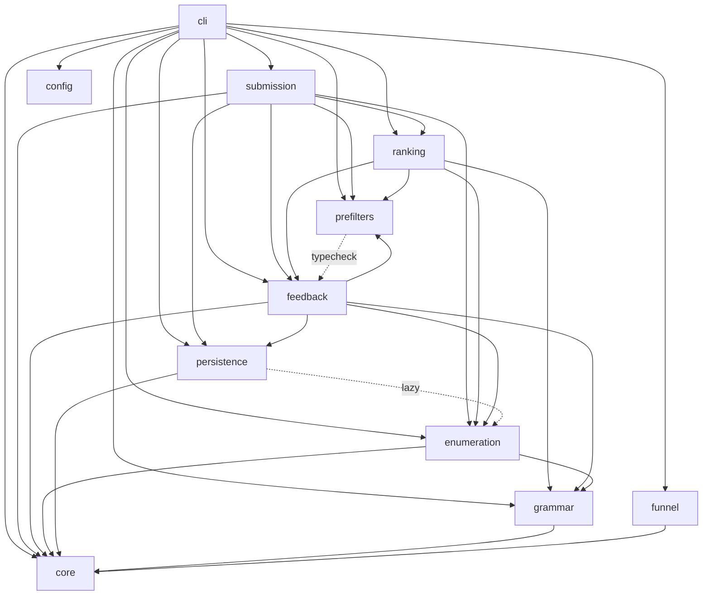

# Fable audit — dependency graph, dead code & duplication (2026-07-06)

Structural audit of `src/forge`: module dependency graph (cycles, god objects, layering)
plus dead code, duplicated logic, and functions over 50 lines — with a single proposed
abstraction per duplication cluster. Prioritized workplan in §8. Sixth `fable-audit/` track.

## Snapshot & method

- HEAD `5ac7941` (2026-07-06); tree clean except one operator-untracked relay
  (`PROMPT_PROMOTION_STRATEGY_HANDOFF.md`). All file:line refs are against this commit.
- `src/forge`: 101 files, 24,530 lines. Tests: 1,829 collected. `ruff check` clean
  (so zero unused imports — F401 is in the select set).
- Method (all deterministic, re-derivable):
  1. **Import graph** — AST walk of every `src/forge` module; edges classified
     `top` (module-level), `func` (function-scope/lazy), `typecheck`
     (`if TYPE_CHECKING:`). Cycles via Tarjan SCC at module level; package level
     condensed to `forge.<pkg>`.
  2. **Long functions** — AST spans, docstring lines subtracted ("effective" lines).
  3. **Dead names** — every top-level def/class/const in src cross-referenced
     (word-boundary) against src + tests + scripts; Typer-registered callbacks excluded;
     survivors traced by hand for transitive deadness.
  4. **Duplication** — normalized token shingles (identifiers→ID, literals→NUM/STR),
     Jaccard over 6-grams, pairs ≥ 0.55 reviewed by hand (one false positive discarded:
     `sampler._sample_pairs_template_params` vs `_sample_pre_earnings_setup_params` —
     similarity is docstring-shape + `rng.choice` dict idiom, not shared logic).
- Read-only: nothing outside this folder was modified.

**Relation to `codebase-quality/` (2026-07-01):** three findings here re-confirm that
track at today's HEAD (its SRC-M1/M2/M3 = this report's C1, C4, L1); this report adds the
graph-level evidence, the transitive-dead trace, four new duplication clusters, the
`cli.main ↔ shadow_null_cmd` cycle, and the long-function census. Shared items carry
cross-refs — per the fable-audit README rule, land each shared item once and tick it
in every plan.

## Verdict

**No strict import cycles. No hard-rule violations. Almost no dead code.** The graph is
fundamentally sound: dependencies flow pipeline-order (cli → {submission, ranking,
prefilters, enumeration, feedback} → grammar/persistence → core), only 1 of ~390
underscore-private top-level names is dead, and the two real cycles are both "soft"
(one type-only, one lazily broken). The debt is concentrated in **three god modules built
by accretion** (`cli/main.py`, `feedback/rejection_weights.py`, `enumeration/sampler.py`)
and **one duplication super-cluster** (nine ~1.00-similarity learned-weight loaders in
`cli/main.py`) whose fix simultaneously removes ~350 clone lines *and* the daemon's
biggest per-iteration I/O waste.

---

## §1 Package dependency graph

Runtime (`top` + `func`) edges, condensed to packages. `typecheck`-only edges dashed.

Layer reading (bottom → top): `core` → `config`/`persistence`/`grammar` → `enumeration` →
`prefilters` → `ranking` → `submission`/`feedback`/`funnel` → `cli`. Every solid edge
points downward except the four flagged in §2–§3.

**Fan-in leaders** (modules most depended on — the load-bearing vocabulary):

| fan-in | module | note |
|---|---|---|
| 18 | `prefilters.types` | the FilterContext/Protocol hub — healthy for a types module |
| 11 | `core.clock` | hard-rule #8 working as designed |
| 9 | `feedback.types` | healthy |
| 8 | `ranking.types`, `grammar.models` | healthy |
| 7 | `persistence.db`, `prefilters.calibration` | healthy |
| 6 | `feedback.rejection_weights` | **not** healthy — a 1,405-line compute module used as a vocabulary source (§3 L2) |

**Fan-out leaders:** `cli.main` 46 (next highest: 12). See §4 G1.

Orphan check: only `feedback.threshold_proposer` has zero src importers — documented
as script-only surface (`scripts/propose_threshold_tightenings.py`, D073, noted in
`docs/architecture.md`). Not dead; correctly classified.

---

## §2 Circular dependencies

**C0 (healthy headline):** zero module-level SCCs on strict top-level imports.
Both cycles below exist only when func-scope/TYPE_CHECKING edges are counted.

### C1 (MEDIUM) — `prefilters ↔ feedback` type-only package cycle

- `prefilters/types.py:29` and `prefilters/expected_trades.py` import
  `feedback.trade_rate_priors.{BucketKey, BucketStats}` under `TYPE_CHECKING`;
  runtime direction is `feedback.auto_tune → prefilters.calibration` (top-level).
- = codebase-quality **SRC-M3** (its item 12), still present. Runtime-safe, but it means
  the type vocabulary of a *prefilter* (expected-trades bucketing) lives in the
  *feedback* package, and any future non-lazy import in either direction imports a cycle.
- Fix: move `BucketKey`/`BucketStats` into `prefilters.types` (or a neutral leaf) and
  have `trade_rate_priors` import them downward. Pure type relocation; re-export at the
  old path for compat.

### C2 (LOW-MEDIUM, new since 07-01) — `cli.main ↔ cli.shadow_null_cmd`

- `main.py:38` imports `shadow_null_app` at module top (Typer registration, :2750);
  `shadow_null_cmd.py:170` lazily imports `_build_feature_cache` **back from `main`**
  inside `cmd_run`.
- Works only because the back-edge is function-scope. Root cause: `_build_feature_cache`
  (main.py:154, 57 effective lines) is a shared *pipeline* helper trapped in the god
  module, so sub-commands must reach back into it.
- Fix: move `_build_feature_cache` to a neutral home (e.g. `forge/prefilters/` beside the
  caches it constructs, or a `cli/_shared.py`), keep `forge.cli.main._build_feature_cache`
  bound as a re-export — `tests/unit/test_cli/test_feature_cache_fallback.py:29` imports
  it from `main` (D065/D105/D106 seam discipline).

---

## §3 Layer violations (acyclic but wrong-direction / misplaced vocabulary)

### L1 (MEDIUM) — `ranking → feedback.rejection_weights` ×3, for two shared symbols

- `ranking/dataset.py:24`, `ranking/evaluation.py:22`, `ranking/arm_floor.py:32` import
  `CLEAN_ERA_LABEL_CUT` and/or `honest_regime_coverage_row` — top-level — from a
  1,405-line learned-weights module. No cycle (feedback never imports ranking), but a
  mid-layer package takes a hard dependency on the heaviest feedback module to get one
  constant and one 15-line predicate.
- These two names are *gated-run interpretation semantics* (which era labels are honest;
  whether a run's regime coverage row is trustworthy) — vocabulary shared by ranking,
  feedback, and `scripts/`. They belong in a leaf module.

### L2 (LOW) — `submission.rate_limiter:45 → feedback.consumer.STRANDED_AFTER`

Same shape as L1: a reconciliation-semantics constant (when a submitted row counts as
stranded) imported top-level from a 561-line consumer module by the rate limiter.

**Single fix for L1+L2:** one leaf module (e.g. `forge/feedback/semantics.py` with zero
non-core imports, or `forge/core/gated_semantics.py`) holding
`CLEAN_ERA_LABEL_CUT`, `honest_regime_coverage_row`, `STRANDED_AFTER`; old locations
re-export. Byte-identical behavior; kills three top-level cross-layer edges.

### L3 (LOW) — `persistence.registry_loader:109 → enumeration._demo_registry` (lazy)

Persistence (a bottom layer) reaches up into enumeration for the demo-registry fallback.
Documented-historical (the module docstring explains it predates Crucible's export).
Optional fix: relocate `_demo_registry.py` to `persistence/` next to its only consumer,
or inject the fallback from the caller. Cosmetic; do only if touched anyway.

**Explicitly checked and fine:** `feedback → enumeration.underlying_class` (downward),
`funnel` a pure leaf, `config`/`core` import nothing above themselves,
no `equity`-family or Crucible-internal imports anywhere (hard rules #2/#7 hold in the
graph).

---

## §4 God objects

### G1 (HIGH visibility, constrained) — `cli/main.py`: 2,760 lines, 57 top-level defs, fan-out 46

The one true god module. Contains: the Typer app + commands; the daemon run loop
(`_run_one_iteration`, main.py:1742 — **603 effective lines**, the largest function in
the repo by 2.4×); `cmd_run` (:2472, 255 lines); **nine ~identical learned-weight
loaders + nine `_format_*_line` twins** (§6 D1); the feature-cache builder (§2 C2);
and misc battery/enumeration glue. Fan-out 46 = it imports from every package.

Constraint (why this is not a "split the file" recommendation): ~10 test files
monkeypatch `forge.cli.main` internals and its structure is deliberate
(D065/D105/D106, CLAUDE.md pitfall). The tractable moves are the ones that *shrink it
in place* keeping every name bound: D1 collapses ~430 lines to ~80, C2 relocates
`_build_feature_cache` with a re-export. Both were verified against the seam list —
none of the nine loaders is patched or imported by tests (codebase-quality SRC-M1's
seam analysis, re-confirmed at this HEAD).

### G2 (MEDIUM) — `feedback/rejection_weights.py`: 1,405 lines, 38 top-level defs

Eleven sibling `compute_*` public functions (one per weight axis: hypothesis, component,
bucket, underlying-class, underlying-name, directional-bucket, cohort-yield,
regime-gate-yield, orthogonal-discount, relative-value-regime, + reward), largely built
by copy-then-vary (§6 D2), plus a dead legacy stratum (§5 X2), plus the shared-vocabulary
symbols that L1 wants extracted. Fan-in 6. This is accretion, not design; the D2
abstraction is the fix, the file then falls to roughly half its size.

### G3 (LOW-MEDIUM) — `enumeration/sampler.py`: 1,336 lines; `sample_config` (:426) 216 effective lines

`sample_config` inlines per-field sampling and per-hypothesis dispatch; the per-template
param samplers below it are independent and fine. Decompose `sample_config` into
per-concern stages only under a determinism harness (hard rule #6: same
`(grammar_version, registry_hash, seed)` → byte-identical sequence — the property tests
exist; run them per extraction). Not urgent; it is well-commented and single-purpose.

### G4 (borderline, acceptable) — `prefilters/crucible_feature_cache.CrucibleFeatureCache` (:80): 390-line class, 11 methods

Largest class in the repo (next: 97 lines). It mixes three concerns — db_writer socket
client, per-date window fetch, batch prefetch orchestration (`prefetch_for_batch`
:254, 66 lines). Cohesive enough to leave; if `pipeline-performance` P-items touch
prefetch, split transport (socket I/O) from cache policy then.

**Not god objects, despite size:** `grammar/custom_predicates.py` (1,049 lines) is
deliberately one function per §3.5 rule — that redundancy is operator-legibility
(hard rule #1), do not merge; `cli/healthcheck_cmd.py` (615 lines) is one check per
concern with a clean result type; `prefilters.types` fan-in 18 is a types hub doing
its job.

---

## §5 Dead code

Near-clean. Full-corpus cross-reference found ~390 file-private names (all referenced
within their file — healthy) and exactly one dead top-level name; hand-tracing added one
transitively-dead stratum.

### X1 (trivial) — `cli/ranker_model_cmd.py:75` `_REWIRE_DELTA_CRITERION`

Zero references anywhere (src, tests, scripts, own file). One-line delete.

### X2 (MEDIUM value) — the pre-component legacy stratum in `rejection_weights.py`: test-only

| symbol | line | status |
|---|---|---|
| `compute_hypothesis_weights` | :77 | **no src/scripts callers**; 1 test file; superseded by `compute_hypothesis_component_weights` (the D094→D108 lineage's live end) |
| `compute_hypothesis_reward_weights` | :222 | **no src/scripts callers**; 2 test files |
| `_iter_hypothesis_outcomes` | :53 | called only by the two above → transitively dead |

~150 src lines including their design-history comment blocks (:118–:220 narrate the
promotion-only→reward evolution), plus their `__all__` entries (:1397–:1398) and their
unit tests. **Cross-refs:** this is codebase-quality's `rejection_weights.py` dead-code
item, and deleting it **closes pipeline-performance P4-8 by deletion** (its
`_iter_hypothesis_outcomes` full-scan concern is about this exact code). Keep
`prior_mean` (:110) — live via `main.py:553` cold-start fallback — and
`component_prior_mean` (:425) — live via :661.
Preserve the history: the comment blocks are genuinely good D-entry narrative; move the
two paragraphs' key lines into the D-entry that lands the deletion, not into live code.

**Also checked, not dead:** `threshold_proposer.py` (script-only, documented);
`compute_relative_value_regime_weights` (live at `main.py`); all five one-time
"stub" indicators (memory trap — liveness comes from code, not
`INDICATOR_THRESHOLDS.md`).

---

## §6 Duplicated logic — one proposed abstraction per cluster

Jaccard ≥ 0.55 pairs, hand-verified, clustered. Similarity scores are on normalized
tokens (1.00 = structurally identical up to names/literals).

### D1 (HIGH, the super-cluster) — nine learned-weight loaders + nine formatter twins in `cli/main.py`

- Loaders (pairwise 0.87–**1.00**): `_load_hypothesis_weights` :686,
  `_load_regime_weights` :783, `_load_bucket_weights` :858,
  `_load_underlying_class_weights` :908, `_load_underlying_name_weights` :955,
  `_load_directional_bucket_weights` :1003, `_load_orthogonal_yield_discounts` :1052,
  `_load_cohort_yield_weights` :1119, `_load_regime_gate_yield_weights` :1173.
  Each ~40 lines differing only in the `compute_*` function called, the log prefix, and
  the degrade-flag global. Plus nine `_format_*_line` twins (~8 lines each).
- **Each loader independently calls `load_recent_gated_runs_from_export(...)`**
  (call sites :739, :813, :884, :933, :980, :1027, :1080, + :1133 region and
  `_fetch_promoted_configs` :1288) and `_run_one_iteration` invokes all of them per
  daemon cycle — up to ~10 full parses of the same ~10k-row JSON export per iteration.
- **Abstraction:** one private
  `_load_weights_from_export(gated_runs, compute_fn, *, label, degrade_flag)` driven by
  a table of `(name, compute_fn)` rows, with the export parsed **once** per iteration
  and threaded through; one `_format_weights_line(label, weights)`. Keep all eighteen
  existing names bound in `forge.cli.main` as thin partials — none is
  test-patched (verified), but seam discipline says keep them anyway.
- ≈ 430 lines → ~80, and the daemon's largest recurring parse waste disappears.
  **Cross-refs:** = codebase-quality item 9 (SRC-M1) ∪ pipeline-performance P1-1 —
  landing this ticks both.
- Verification: journal weight lines byte-identical across a before/after run on the same
  export snapshot; cold-start determinism suite; `test_run_loop.py` untouched.

### D2 (MEDIUM-HIGH) — the keyed-weights engine in `rejection_weights.py`

- `compute_cohort_yield_weights` :903 ↔ `compute_regime_gate_yield_weights` :972
  (**0.92**); both ↔ `compute_hypothesis_directional_bucket_weights` :827 (0.83, 0.77);
  `compute_underlying_class_weights` :717 ↔ `compute_underlying_name_weights` :759
  (0.67); helper twins `_directional_indicator_of` :807 ↔ `_regime_indicator_of` :1206
  (**0.98**) and `_hyp_dir_bucket_cohort_of` :939 ↔ `_hyp_dir_bucket_regime_of` :1011
  (0.84).
- Shared shape: iterate gated runs → derive a group key from the config → Beta-posterior
  per key → normalize to max. Variation points: key function, α/β constants, era filter.
- **Abstraction:** one generic
  `_compute_keyed_component_weights(runs, key_of, *, alpha, beta, ...)`; each public
  `compute_*` becomes a documented key function + a 5-line wrapper. Public names,
  signatures, and outputs unchanged.
- ⚠ Determinism caution (hard rule #6): weights feed the sampler; a versionless change
  must be **cold-start byte-identical**. Preserve iteration order and float-op order
  exactly (same accumulation sequence, same normalization); add a golden-value test on a
  fixture export before refactoring, run the invariant suite after.

### D3 (MEDIUM) — verdict/robustness persistence quadruplet in `ranking/model.py`

`load_model` :397 ↔ `load_robustness_model` :748 (**1.00**); `score_features` :324 ↔
`score_robustness` :638 (0.85); `save_model` :374 ↔ `save_robustness_model` :724 (0.75);
`_payload` :355 ↔ `_robustness_fields` :486 (0.80). ≈ 120 duplicated lines.
**Abstraction:** parameterize by a frozen field-spec + filename prefix + `kind` tag.
⚠ Artifact bytes are content-hashed into `model_id` — **golden-file byte-identity test
BEFORE refactoring** (= codebase-quality item 11 / SRC-M2, unchanged at this HEAD).

### D4 (LOW-MEDIUM) — grouped-triples readers in `ranking/evaluation.py`

`_tail_triples_by_model` :318 ↔ `_tail_triples_by_hypothesis` :402 (0.79); both ↔
`_rewire_triples` :555 (0.67). One `_grouped_triples(rows, group_of, fields)` helper.
Telemetry-only surface (eval CLI), so low risk; verify with the existing eval tests.

### D5 (LOW) — small twins, each a one-parameter merge

| pair | sim | proposed single form |
|---|---|---|
| `status_cmd.rewire_flip_gate` :160 ↔ `tail_flip_gate` :175 | **1.00** | one `_flip_gate(streak_path, label)` |
| `proposer._proposal_from_hypothesis_pattern` :134 ↔ `_proposal_from_family_pattern` :170 | 0.85 | one builder taking the pattern-kind + key extractor |
| `status_cmd._read_jsonl` :235 ↔ `preregistration.load_preregistrations` :114 | 0.69 | shared tolerant-JSONL reader (e.g. `core` or `persistence`) — only if touched anyway |

### D6 (test-side, from codebase-quality, re-confirmed) — `GatedRun` construction spread

17 test files construct `GatedRun(...)` inline, several via local near-identical factory
helpers (`tests/unit/test_feedback/*` cluster). One conftest factory fixture with
field overrides. Unchanged since 07-01; tick codebase-quality's item when landed.

### Deliberate near-duplication — leave alone

`custom_predicates._x1_*` :965 ↔ `_x2_*` :989 (0.77) and the whole one-function-per-rule
layout: §3.5 rules are operator-owned (hard rule #1) and per-rule legibility is the
point. `predicates.evaluate_requires` :205 ↔ `evaluate_forbids` :243 (0.63): the
require/forbid symmetry reads clearer duplicated; merging saves ~30 lines and costs
clarity — skip.

---

## §7 Functions over 50 effective lines (docstrings excluded): 50 total

Full census in the table below (top 20; the tail 30 sit at 51–72 lines and are ordinary).
Classification matters more than the count:

- **Orchestrators (decompose only when touched, under their test seams):**
  `_run_one_iteration` main.py:1742 (**603**) — the daemon cycle; linear, stage-labeled,
  but far past readable; D1 alone removes ~90 of its call-site lines; a later
  stage-extraction (enumerate/filter/rank/submit/feedback as private functions, names
  kept in `main`) is the follow-up. `cmd_run` :2472 (255), `cmd_prefilter` :233 (110),
  `consume_batch_results` consumer.py:244 (96), `submit_batch` submitter.py:267 (65).
- **Data tables masquerading as functions (exempt):** `demo_registry`
  \_demo_registry.py:25 (216) — a literal registry; `load_calibration`
  calibration.py:221 (142) — mostly schema/defaults handling.
- **Real decomposition candidates (standalone value):**
  `sample_config` sampler.py:426 (216, §4 G3); `_submit_one` submitter.py:131 (134 — the
  submit state machine; extract the idempotency-check / write / record stages);
  `check_rate_limit` rate_limiter.py:113 (111 — three independent block reasons already
  documented as such in `architecture.md`; one function per block reason);
  `enumerate_candidates` iterator.py:86 (131);
  `_select_top_n_floored` diversifier.py:217 (86).
- **CLI report bodies (cosmetic, skip):** `cmd_healthcheck` :458 (138),
  `shadow_null_cmd.cmd_run` :131 (137), `cmd_feedback` :55 (107),
  `cmd_apply_proposal` :172 (105), `cmd_revert` :295 (103), ranker-model cmds (52–102).

| eff. lines | function |
|---|---|
| 603 | `cli/main._run_one_iteration` :1742 |
| 255 | `cli/main.cmd_run` :2472 |
| 216 | `enumeration/_demo_registry.demo_registry` :25 *(data)* |
| 216 | `enumeration/sampler.sample_config` :426 |
| 142 | `prefilters/calibration.load_calibration` :221 *(mostly schema)* |
| 138 | `cli/healthcheck_cmd.cmd_healthcheck` :458 |
| 137 | `cli/shadow_null_cmd.cmd_run` :131 |
| 134 | `submission/submitter._submit_one` :131 |
| 131 | `enumeration/iterator.enumerate_candidates` :86 |
| 111 | `submission/rate_limiter.check_rate_limit` :113 |
| 110 | `cli/main.cmd_prefilter` :233 |
| 107 | `cli/feedback_cmd.cmd_feedback` :55 |
| 105 | `cli/grammar_cmd.cmd_apply_proposal` :172 |
| 103 | `cli/grammar_cmd.cmd_revert` :295 |
| 102 | `cli/main._run_battery_for_seed` :1403 |
| 102 | `cli/ranker_model_cmd.cmd_train_robustness` :492 |
| 96 | `feedback/consumer.consume_batch_results` :244 |
| 94 | `cli/main._consume_feedback_after_submit` :1608 |
| 90 | `prefilters/permutation_test.PermutationTestFilter.apply` :134 |
| 86 | `ranking/diversifier._select_top_n_floored` :217 |

---

## §8 Prioritized workplan

All items are versionless code changes (no grammar bump), but several touch the sampler's
inputs → hard-rule #6 byte-identity applies where marked. This tree is production: build
each item in a worktree or a short clean window, land only verified commits
(`docs/tasks/quality-gates.md`); none of these requires a service restart by itself, but
any deploy follows `docs/tasks/deploy.md`.

| P | item | refs | effort | gating / caution | verify |
|---|---|---|---|---|---|
| **P0-1** | Parse export once per iteration; collapse the 9+9 loader/formatter clones into `_load_weights_from_export` + a table; keep all names bound in `main` | §6 D1 (= CQ item 9, PP P1-1) | ~half-day | none (versionless); seam-safe (verified) | byte-identical journal weight lines on a fixed export; determinism suite; `test_run_loop.py` green |
| **P0-2** | Delete the dead stratum: `compute_hypothesis_weights`, `compute_hypothesis_reward_weights`, `_iter_hypothesis_outcomes`, their tests + `__all__` entries; also `_REWIRE_DELTA_CRITERION`. Preserve the design narrative in the D-entry | §5 X1/X2 (= CQ dead-code item; **closes PP P4-8**) | ~1h | keep `prior_mean` + `component_prior_mean` (live) | grep-zero; full suite |
| **P1-1** | Extract shared gated-run semantics (`CLEAN_ERA_LABEL_CUT`, `honest_regime_coverage_row`, `STRANDED_AFTER`) to a leaf module; old paths re-export | §3 L1+L2 | ~2h | none | suite; import-graph re-run shows the 4 edges gone |
| **P1-2** | Move `BucketKey`/`BucketStats` down to break the type-cycle | §2 C1 (= CQ item 12/SRC-M3) | ~1h | pure type move | mypy --strict; graph re-run: no pkg cycle |
| **P1-3** | Relocate `_build_feature_cache` out of `main`; re-export in `main` | §2 C2 | ~1h | test imports it from `main` — re-export mandatory | `test_feature_cache_fallback.py`; graph re-run: no cli cycle |
| **P2-1** | `model.py` persistence quadruplet → field-spec parameterization | §6 D3 (= CQ item 11/SRC-M2) | ~half-day | **golden-file byte-identity test FIRST** (`model_id` = content hash) | golden files unchanged; suite |
| **P2-2** | `rejection_weights` keyed-weights engine (`_compute_keyed_component_weights` + key fns) | §6 D2, §4 G2 | ~1 day | **hard-rule #6**: cold-start byte-identical; golden-value fixture test first; preserve float-op order | golden values; invariant suite; journal lines identical |
| **P2-3** | Long-function extractions with standalone value: `_submit_one`, `check_rate_limit` (one fn per block reason), `sample_config` stages | §7 | ~1 day | `sample_config` under the determinism property tests per extraction | suite + property tests |
| **P3-1** | `evaluation.py` grouped-triples helper; `status_cmd` flip-gate twin; `proposer` pattern-pair | §6 D4/D5 | ~2h | telemetry-only | eval/status tests |
| **P3-2** | Shared `GatedRun` conftest factory | §6 D6 (= CQ test item) | ~2h | tests-only | suite |
| **P3-3** | Optional: `_demo_registry` relocation; shared JSONL reader | §3 L3, §6 D5 | ~1h | only if touched anyway | suite |
| — | **Do NOT:** split `cli/main.py` into modules wholesale (D065/D105/D106 seams); merge per-rule predicates in `custom_predicates.py` (hard rule #1 legibility); "fix" `_run_one_iteration` in one big rewrite — shrink it via P0-1 then stage-extract opportunistically | §4 G1, §6 | — | — | — |

Sequencing note: P0-1 before P2-2 (both touch the weight path; P0-1 changes call sites
P2-2's tests will pin). P2-1's golden test is a precondition, not a follow-up. After
P0/P1 land, re-run the §1 graph derivation and append the before/after edge counts here.

## Explicitly verified healthy

Zero strict import cycles · zero unused imports (ruff F401 clean) · 1 dead top-level
name out of ~1,100 · all ~390 file-private names referenced · no Crucible-internal or
equity-family imports in the graph (hard rules #2/#7) · clock/seed discipline visible as
fan-in (11 modules → `core.clock` only) · `funnel`/`config`/`core` are clean leaves ·
orphan module count: 1, documented · package layering violation count: 4 edges out of
~230, all catalogued above.
