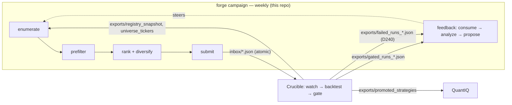

# Architecture — as-built map

Scope: where code lives, how data flows, how changes are classified and attributed. Intent/spec
lives in `docs/DESIGN.md` (§ refs below); live state in `STATUS.md`; terms in §Terms at the bottom of this file.

## The pipeline

Forge → Crucible → QuantIQ. All inter-system traffic is **files under `~/optbt_data/`** — never
direct DB access (Crucible's `runs.duckdb` is single-writer-locked; Forge reads Crucible only via
its file exports, through `crucible_contracts` helpers).

Per-batch order (§2.1, fixed): load grammar (verify version + archive) → snapshot registry →
enumerate (lazy, seeded) → pre-filter battery (cost-ascending, short-circuit on first failure) →
rank (§6.2 composite) → diversify (greedy, min-per-hypothesis floor) → submit (atomic, idempotent)
→ rate-limit (§7.3, three independent block reasons: ≥80% of the oldest in-flight batch must be
gated; OR the D137 stall guard trips — Crucible idle ≥3h with our work pending; OR the aggregate
in-flight depth exceeds `submission.max_inflight` — the D196 backpressure block bounding the total
genuine in-flight queue, default-off, operator-enabled, D200) → consume feedback →
analyze → propose (auto-apply tightenings; loosenings → `OPEN_PROPOSALS.md`). Cross-batch state
lives in `~/forge_data/forge.db` only — never in process memory across runs.

## Module map

| Package (`src/forge/`) | Role | Spec | Tests (`tests/unit/`) |
|---|---|---|---|
| `grammar/` | Load/validate `config/grammar.yaml`; predicate engine; S4 horizon table (`signal_horizon.py` — Forge-owned, registry `lookback` is a warmup not a horizon, D102); archive consistency (`archive.py`) | §3 | `test_grammar/` |
| `enumeration/` | Search space + seeded sampler; per-indicator threshold table (`indicator_thresholds.py`); underlying classes (`underlying_class.py`); registry fingerprint | §4 | `test_enumeration/` |
| `prefilters/` | `battery.py` runs filters cost-ascending — the live order is in code, not the §5.2 list (it grew past the original 7); `crucible_feature_cache.py` = real cache (via db_writer socket), `feature_cache.py` = synthetic fallback | §5 | `test_prefilters/` |
| `ranking/` | The learned ranking models the weekly campaign ranks with (trained in-run) — per-file breakdown below the table; the §6.2 composite scorer, diversifier, floors and flip apparatus left with the daemon (D419) | §6 | `test_ranking/` |
| `submission/` | Batch orchestration; atomic submit via contracts; §7.3 rate limiter; per-filter logging; `search_multiplicity.py` (D310 — per-slot cumulative `search_n_trials` stamp, self-gated on Crucible's `recorded_not_binding` marker); submission lanes tagged `selection_mode` ∈ {ranked, holdout, prefilter_sample, tail_lane, trend_lane} (P3.3/D335/`8cfe95f4a6e9`; the dark D316 young_explore lane was removed 2026-08-06, D378) | §7 | `test_submission/` |
| `feedback/` | Consume gated/failed exports, learn weights, propose grammar changes — per-file breakdown below the table | §8 | `test_feedback/` |
| `funnel/` | Per-batch funnel + join-map exports consumed by Crucible's instrumentation (D096) | D096 | `test_funnel/` |
| `campaign/` | The weekly zero-input challenger run (plan 2026-09 §12, the final state): `types.py` (contract), `cells.py` (census cell key, the promoted book via contracts, per-cell verdict stats, dead-cell rule), `triggers.py` (T1–T5 as pure functions + weekly-cap allocation), `gate.py` (structural challenger gate), `run.py` (boot → reconcile → decide → rejection-sample the unchanged v55 population → battery → gate → rank → submit), `report.py` (replayable `campaign_run/v1` records + `status`). CLI: `cli/campaign_cmd.py`. Units not installed until cutover (D409). | §12 (plan) | `test_campaign/`, `invariants/test_campaign_invariants.py` |
| `persistence/` | `db.py` (the blessed DB open), `schemas.py` (forge.db DDL — table summaries in `docs/MANPAGE.md`), `verdicts.py` (durable per-candidate verdict recording, D111; +label provenance `source_export`/`contracts_version`, D316), `registry_loader.py` | §9 | `test_persistence.py` |
| `core/` | `clock.py` + `seed.py` (the ONLY time/RNG sources, hard rule #8); `contracts_check.py` (holds the `FORGE_EXPECTED_CONTRACT_VERSION` pin, §13.5); `logging.py` | §13 | `test_phase0_smoke.py` |
| `config/` | `forge_config.py` — precedence: CLI flag > `config/forge.yaml` > hardcoded (`--no-config`) | §10 | `test_config/` |
| `cli/` | `main.py` (`forge` entry point: `version`, `check`, `enumerate`, `prefilter` — the last two are offline diagnosis on the demo registry), `campaign_cmd.py` (`forge campaign` + `status`, the weekly run, plan 2026-09 §12), `prereg_cmd.py` (`forge prereg` — the preregistration ledger the `freeze-governance` hook reads, D392). The daemon (`forge run --loop`) and its operator commands left in Batch 5 G1 (git history holds them). | — | `test_cli/` |

**`ranking/` breakdown** (6 files after Batch 5 G2):
- `features.py` — featurize a config against the registry family map (the model input).
- `dataset.py` — the honest-era training frame (verdicts ⋈ submissions; era cuts from
  `feedback/eras.py`; D128 coverage-honest labels).
- `model.py` — pure-Python IRLS verdict / robustness / tail models + artifact load/save
  (`QUALITY_LANE_TARGET` = the robustness target the campaign ranks with).
- `shadow.py` — per-submission shadow scores, the retraining telemetry.
- `signal_key.py` — signal content keys + Jaccard (the challenger gate's duplicate measure).
- `types.py` — `RankedCandidate` (what the submitter persists).
Deleted 2026-09-15 (D419, git history has them): `queue`, `diversifier`, `arm_floor`, `cell_floor`,
`scorer`, `config` (+ `config/ranker.yaml`), `prior_promotion`, `calibration`, `drift`,
`sequential_test`, `evaluation`, `campaign_audit`, `campaigns` (the D299 registry — its cell-key
extractors live in `campaign/cell_key.py`), `regime_supply`.

**`feedback/` breakdown**:
- `consumer.py` — reconcile + aged-out flush (D052/D110) + failed-run retirement (D240).
- `analyzer.py` / `proposer.py` / `proposal_writer.py` (§9.1 — loosenings to
  `OPEN_PROPOSALS.md` + `grammar_proposals`; wires `trade_concentration.py`, D047) /
  `promoted_patterns.py` / `stuck_state.py`.
- Learned weights: `rejection_weights.py` (the D094→D108 lineage), `trade_rate_priors.py`
  (expected-trades prior + cold-start). (`auto_tune.py` was retired — D325; git history has it.)
- Honesty ledgers: `preregistration.py` (behind `forge prereg`, D208, and the campaign's boot
  DUE judge, D417; the D207 alpha-budget sibling retired 2026-08-06). `yield_audit.py` (D302)
  was deleted 2026-09-15 (D419) — the dead-cell rule lives in `campaign/cells.py`.
- Deleted: `threshold_proposer.py` (D298; git history has it).

A `king/` package (the meta-king generator arm) was retired at D190 and **removed from
the tree** in the same commit (`f79394a`) — role subsumed by the standard-path quality lane;
git history holds the code (a stale local `__pycache__` may linger).

## Change taxonomy — how a change is classified and attributed

This is the most load-bearing non-obvious convention in the repo:

| Kind | When | Ritual | Attribution |
|---|---|---|---|
| **Grammar-versioned** (enumeration-policy bump) | The emitted config *population* changes (new hypothesis, parameter bounds, predicate pool, threshold/horizon table) | Bump `grammar_version`, archive, D-entry — `docs/tasks/grammar-change.md`. Since v5, most bumps change **no `rules:` text**: the 21 §3.5 rules are operator-owned (hard rule #1); policy lives Python-side | Crucible runs `crucible funnel --compare vN-1 vN` on the cohort — relay the version string + deploy timestamp |
| **Versionless** (feedback/weights) | Only the *draw distribution* over the same population changes | Cold-start byte-identical required (hard rule #6) — `docs/tasks/feedback-change.md` | Read in the submission mix + journal weight lines; `--compare` is confounded |
| **Contracts-gated** | Forge needs a model/field `crucible_contracts` lacks | Surface the gap (hard rule #2), never import Crucible internals; on adoption bump the pin in `core/contracts_check.py` + `uv.lock` + fixtures | `forge check` validates at startup |

Determinism identity: `(grammar_version, registry_hash, seed)` → same enumeration sequence
(hard rule #6; property-tested).

## Live deployment

- Box `aj-workstation`, timezone **UTC since 2026-06-07** (older records are PDT — convert before joining).
- **No daemon since the 2026-09-14 cutover (D416).** `forge-campaign.timer` runs `scripts/campaign_run.sh`
  → `forge campaign` from **this working tree** via editable install, Sundays 03:00 UTC, in the unit's
  `FORGE_CAMPAIGN_MODE=live`. A reboot re-arms the timer onto whatever the tree contains (the D104
  hazard, now at weekly cadence) — hence `docs/tasks/deploy.md`: preflight → commit → the next run deploys.
- Crucible services/timers and start/stop order: `docs/MANPAGE.md` (PIPELINE SERVICES) and `docs/HOW-TO.md`.
- Forge timers (units in `deploy/systemd/`, symlinked into `~/.config/systemd/user/`): `forge-campaign`
  (Sunday 03:00 UTC, `scripts/campaign_run.sh` — the weekly zero-input challenger run, plan 2026-09 §12;
  mode `live` since the 2026-09-14 cutover, D416; it trains its own models in-run and judges open prereg
  clocks at boot, Batch 5 G0) and `forge-backup` (Sunday 04:30 UTC, `scripts/backup_forge_db.sh` — DR copy
  of `forge.db` + `models/`, D195). `forge-ranker-eval`, `forge-prereg-watch`, `forge-healthcheck` and
  `forge-eod-check` are retired (Batch 5 / D253).
- Forge state: `~/forge_data/forge.db` (DuckDB; live RW lock — snapshot before reading, see
  `docs/tasks/investigate-live.md`). Inter-system paths: table in `docs/HOW-TO.md`.
- `scripts/` is operational glue around the daemon, not part of the import graph: pre-commit
  enforcers (`check_grammar_version_bump.py`, `check_grammar_doc_sync.py` — see §13.2 below;
  `check_freeze_governance.py` — the signed-freeze guard, D392), the timer entrypoints
  (`campaign_run.sh`, `backup_forge_db.sh`) and their snapshot idiom (`live_db_snapshot.sh`), the read-only pre-deploy
  GO/NO-GO gate (`deploy_preflight.sh` — codifies the D104 ritual's pre-checks: dirty tree, stale
  contracts pin, inert feature wiring; D199), plus one-off analysis/probe + migration scripts.

## Invariant bookmarks (§13)

| Invariant | Enforced by |
|---|---|
| §13.1 deterministic enumeration | `tests/invariants/test_phase2_invariants.py`, `tests/integration/test_batch_reproducibility.py` |
| §13.2 grammar version safety | `scripts/check_grammar_version_bump.py`, `scripts/check_grammar_doc_sync.py` (pre-commit) + `forge.grammar.loader` archive check at startup |
| §13.3 no silent grammar changes | `tests/invariants/test_phase5_invariants.py` (audit row + hard rule #4 structure) |
| §13.4 submission idempotency | `tests/invariants/test_phase4_invariants.py`, `tests/invariants/test_phase6_properties.py` (Hypothesis) |
| §13.5 contracts compatibility | `forge.core.contracts_check.check_contracts_version` at CLI startup (halts on MAJOR mismatch) |
| §13.6 no equity exposure | `tests/invariants/test_phase1_invariants.py` |
| §13.7 resource limits | carry-forward (contracts don't yet expose `worker_mem_limit_mb`) |

## Root-file taxonomy

The repo root holds a small curated set of `*.md` files; beyond `CLAUDE.md`/`README.md`
(documentation proper) they are **records, not documentation**. Read them only when a specific
exchange or decision cites them. Resolved records are periodically swept to `_archive/` (D202),
so every root file should match a row below.

| Pattern | What it is |
|---|---|
| `STATUS.md` | Live state; newest block on top. Read first, every session. Older months rotate to `_archive/STATUS_<era>.md` |
| `IMPLEMENTATION_DECISIONS.md` | Append-only decision ledger ("D###"), currently D301+; D001–D300 in `_archive/IMPLEMENTATION_DECISIONS_*` slices |
| `OPEN_QUESTIONS.md` | **OPEN** questions only (Q##, severity); resolved entries sweep to `_archive/OPEN_QUESTIONS_RESOLVED.md` in the resolving commit |
| `OPEN_PROPOSALS.md` | Grammar loosening proposals awaiting operator sign-off (hard rule #4). Machine-consumed (`forge-proposals/v1`); never rotated (D298) |
| `PROMPT_CRUCIBLE_PATHC_DEBIT_VERTICAL_SIZING.md` | The one operator-**parked** relay (D152, Path C). The root-relay channel itself is RETIRED — relays live in `~/proj/freeze/relays/` + the two INDEX ledgers (D362, `docs/tasks/crucible-handoff.md`); never create new `PROMPT_*` files at root |
| `_archive/` | Completed/landed records, swept from root/docs once their D-entry lands (D202/D241 criterion): relay pairs, phase handoffs, finished planning artifacts, terminal proposals (`PROPOSAL_*.md`), point-in-time reviews (`AUDIT.md`, `STRATEGY_GENERATION_STATE.md`), and the ledger-rotation slices |

## Terms — domain jargon an agent would misread

(Absorbed from the former `docs/glossary.md`, 2026-08-06; ops terms that duplicate
MANPAGE/HOW-TO rows were dropped. Code identifiers are findable by grep; this covers concepts.)

- **Gated** — Crucible finished backtesting a config and recorded a decision. NOT "passed";
  most gated runs are rejections. `submissions.status` flips `submitted → gated` on reconcile.
- **Component** — a gated config Crucible accepts as a portfolio building block. The component
  rate is Forge's live currency — the binding gate sits at promotion, not gating (current
  rates: `STATUS.md` top block or `forge status`).
- **Promotion** — full gate pass, exported to QuantIQ. Target 1–3% by month 3–6 (§1.3); >5% is
  suspicious (over-tuning to the gate).
- **The gated export** — `~/optbt_data/exports/gated_runs_*.json`, Crucible's rolling top-10k
  window of decisions (`grammar_version` since contracts 1.15.0; join on `config_hash`).
- **Hypothesis** — the one market thesis a config declares (S1). The allowed set is the
  contracts Literal; `regime_arbitrage` left enumeration in v5 (D098).
- **Directional signal vs regime gate** — directionals generate entries; regime signals gate
  *when* entries are allowed. The same indicator can serve both with different ops (hurst:
  `<` directional for MR, `>` regime for trend, D100).
- **Combiner / `cross_sectional_rank`** — how multiple signals merge; xsect-rank ranks a
  universe cross-sectionally instead of gating one underlying (v12, H1).
- **DTE bucket** — discrete days-to-expiry class, derived as `k × signal horizon` from the
  Forge-owned table in `grammar/signal_horizon.py` (D102).
- **Factor cell** — the granularity feedback weights key on, e.g. (hypothesis, directional,
  underlying-name) (D105/D106/D108).
- **Enumeration-policy bump** — a grammar_version bump with NO `rules:` text change; the
  policy shift is Python-side (the norm since v5). See the change taxonomy above.
- **Versionless change** — feedback/weight change re-aiming the draw distribution without
  changing the population; must be cold-start byte-identical (hard rule #6).
- **Cold-start** — sampler behavior with empty learned inputs; pinned byte-identical by golden
  tests. `COLD_START_HYPOTHESES` drops poisoned pre-vN rows so a hypothesis can re-learn.
- **Exploration floor** — the D067 minimum hypothesis weight (`DEFAULT_EXPLORATION_FLOOR` in
  `feedback/rejection_weights.py`); no learned tilt may starve a hypothesis to zero.
- **Anti-Goodhart** — feedback rewards must track what Crucible *accepts* (component rate,
  D105), never proxies like raw trade counts (the D094 reward got Goodharted; tests pin this).
- **Emission proof** — before deploying enumeration changes: sample thousands of configs
  against the live registry export and verify the emitted mix shows the intended change
  (`docs/tasks/grammar-change.md`). A log line is not an emission proof (D352).
- **Uncontended suite** — the full `pytest`; the deploy gate (historically "with the daemon stopped"; no daemon since D416).
- **Breadth vs quality lever** — Grinold framing (IR = IC·√Breadth); the binding gate failure
  is trade count (breadth), so quality-only levers have a low ceiling.
- **Quality lane / `wf_p25`** — the D193 ranking-only robustness blend: a deterministic ridge
  predicting `target_wf_p25` (Crucible's walk-forward FLOOR) folded into the §6.2 prior.
  Predicts DOWNSIDE robustness, not the peak.
- **Yield-map axes** — `--cohort-yield` / `--regime-gate-yield` (D182/D183): finer-grained
  component-rate feedback weighting; versionless, cold-start byte-identical.
- **Aged-out flush / sentinel** — the consumer marks dead `submitted` rows gated with a
  nil-UUID sentinel once behind the export watermark (`feedback/consumer.py` owns the value;
  D110 mechanism; the D240 failed-run retirement reuses the sentinel).
- **Reconcile** — the consumer joining gated + failed exports against `submissions` and
  flipping statuses; every loop iteration.
- **Timestamp eras** — records before 2026-06-07 are PDT (old box), after are UTC; convert
  before joining (`docs/tasks/investigate-live.md`).
- **Funnel compare** — `crucible funnel --compare vA vB` (Crucible-side) attributes a
  grammar-versioned change by cohort.
