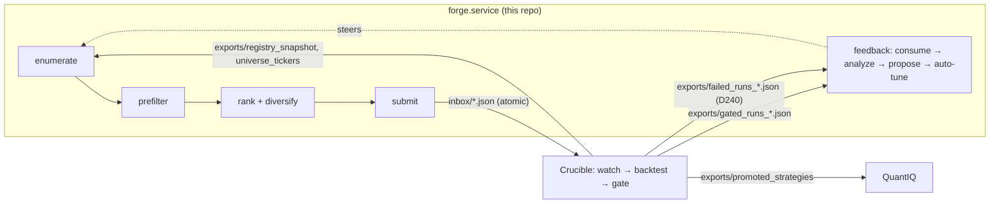

# Architecture — as-built map

Scope: where code lives, how data flows, how changes are classified and attributed. Intent/spec
lives in `docs/DESIGN.md` (§ refs below); live state in `STATUS.md`; terms in `docs/glossary.md`.

## The pipeline

Forge → Crucible → QuantIQ. All inter-system traffic is **files under `~/optbt_data/`** — never
direct DB access (Crucible's `runs.duckdb` is single-writer-locked; Forge reads Crucible only via
its file exports, through `crucible_contracts` helpers).

Per-batch order (§2.1, fixed): load grammar (verify version + archive) → snapshot registry →
enumerate (lazy, seeded) → pre-filter battery (cost-ascending, short-circuit on first failure) →
rank (§6.2 composite) → diversify (greedy, min-per-hypothesis floor) → submit (atomic, idempotent)
→ rate-limit (§7.3, three independent block reasons: ≥80% of the oldest in-flight batch must be
gated; OR the D137 stall guard trips — Crucible idle ≥3h with our work pending; OR the aggregate
in-flight depth exceeds `submission.max_inflight` — the D196 backpressure block bounding the total
genuine in-flight queue, default-off, operator-enabled, D200) → consume feedback →
analyze → propose (auto-apply tightenings; loosenings → `OPEN_PROPOSALS.md`). Cross-batch state
lives in `~/forge_data/forge.db` only — never in process memory across runs.

## Module map

| Package (`src/forge/`) | Role | Spec | Tests (`tests/unit/`) |
|---|---|---|---|
| `grammar/` | Load/validate `config/grammar.yaml`; predicate engine; S4 horizon table (`signal_horizon.py` — Forge-owned, registry `lookback` is a warmup not a horizon, D102); archive consistency (`archive.py`) | §3 | `test_grammar/` |
| `enumeration/` | Search space + seeded sampler; per-indicator threshold table (`indicator_thresholds.py`); underlying classes (`underlying_class.py`); registry fingerprint | §4 | `test_enumeration/` |
| `prefilters/` | `battery.py` runs filters cost-ascending — the live order is in code, not the §5.2 list (it grew past the original 7); `crucible_feature_cache.py` = real cache (via db_writer socket), `feature_cache.py` = synthetic fallback | §5 | `test_prefilters/` |
| `ranking/` | Composite scorer (weights in `config/ranker.yaml`); `queue.py` batch-ranking orchestrator (`rank_batch` composes the §6 components); `prior_promotion.py` Jaccard prior (the pre-F3 fallback); greedy diversifier (`min_per_hypothesis` floor, D103; per-arm exploration floor, D136 — `arm_floor.py` owns arm extraction + the honest-era mature-arm count, young arms get ≤2 reserved slots / ≤10% batch); learned verdict model (`features.py` extraction, `dataset.py` honest-era frame, `model.py` pure-Python IRLS + artifacts, `shadow.py` post-submit telemetry recorder, `evaluation.py` shadow-vs-incumbent readout; born as the D132 shadow-track, now WIRED into the §6.2 prior slot — F3 sets `prior_promotion_proximity := P(component)` instead of Jaccard (D149, live; env kill-switch `FORGE_F3_RANKER=off`), and the wf_p25 quality lane multiplies that by a monotone `tail_norm` of a `target_wf_p25` robustness prediction — `prior := P(component) × tail_norm` (`--quality-rank`, D193 live; kill-switch `FORGE_QUALITY_RANKER=off`); both fill only the prior term, §6.2 weights untouched); `regime_supply.py` per-batch regime-complement supply telemetry (T2 shadow, D144 — the `regime_supply:` journal line; classifies ranked survivors' regime-bets into trending-dominant / ranging / bear / other, never reshapes a batch); learned-audit guards: `calibration.py` (Platt recalibration of P(component), P1.3), `drift.py` (input-drift + model-adoption primitives, P3.2/B6), `sequential_test.py` (SPRT flip/streak gate, B5/P3.1); `signal_key.py` (re-export of contracts `signal_content_key`); campaign registry (`campaigns.py`, D299) — the discover→concentrate→farm lifecycle as code: `experiment_cells.py` DERIVES the D287 selection-cell floor from farming campaigns (pinned byte-identical by test), `campaign_audit.py` is the ranked-vs-holdout carriage detector for the D287 failure class (selection starving a confirmed region); `cell_floor.py` (D307, flag-gated `FORGE_YOUNG_CELL_FLOOR` default off) — young-CELL exploration floor, the D287 protection made automatic (diversifier phase 0c; pinned cells exempt) | §6 | `test_ranking/` |
| `submission/` | Batch orchestration; atomic submit via contracts; §7.3 rate limiter; per-filter logging; `search_multiplicity.py` (D310 — per-slot cumulative `search_n_trials` stamp, self-gated on Crucible's `recorded_not_binding` marker) | §7 | `test_submission/` |
| `feedback/` | `consumer.py` (reconcile + aged-out flush, D052/D110; also reads `failed_runs_*.json` every poll and retires runner-FAILED submissions with the aged-out sentinel, D240); `analyzer.py`; `proposer.py`; `rejection_weights.py` (learned sampler weights — the D094→D108 lineage); `trade_rate_priors.py` (expected-trades prior + cold-start); `auto_tune.py` (prefilter calibration, tighten-only); `proposal_writer.py` (enrich + append to `OPEN_PROPOSALS.md` + `grammar_proposals`, §9.1 — wires `trade_concentration.py`, the T2.5/D047 post-batch concentration analyzer); `promoted_patterns.py` (§9.1 pattern rows); `stuck_state.py` (no-promotions-for-K-batches detector); `preregistration.py` + `alpha_budget.py` (Tier-1a honesty ledgers behind `forge prereg` / `forge alpha-budget`, D208/D207); `yield_audit.py` (D302 — the standing dead-name/cold-cell detector behind `forge yield-audit`: census-class yield reads with ghost-cut + clean-era + farming-campaign-exemption guards; detection only, writes nothing). (`threshold_proposer.py`, the D073 threshold-range proposer, was deleted at D298 — D206 made permanent; git history has it) | §8 | `test_feedback/` |
| `funnel/` | Per-batch funnel + join-map exports consumed by Crucible's instrumentation (D096) | D096 | `test_funnel/` |
| `persistence/` | `db.py` (the blessed DB open), `schemas.py` (forge.db DDL — table summaries in `docs/MANPAGE.md`), `verdicts.py` (durable per-candidate verdict recording, D111), `registry_loader.py` | §9 | `test_persistence.py` |
| `core/` | `clock.py` + `seed.py` (the ONLY time/RNG sources, hard rule #8); `contracts_check.py` (holds the `FORGE_EXPECTED_CONTRACT_VERSION` pin, §13.5); `logging.py` | §13 | `test_phase0_smoke.py` |
| `config/` | `forge_config.py` — precedence: CLI flag > `config/forge.yaml` > hardcoded (`--no-config`) | §10 | `test_config/` |
| `cli/` | `main.py` (`forge` entry point + run loop), `grammar_cmd.py` (`grammar` sub-app), `feedback_cmd.py`, `ranker_model_cmd.py` (`ranker-model` sub-app: dataset/train/eval + the wf_p25 robustness variants, D132/D191), `healthcheck_cmd.py` (`forge healthcheck` — alive-AND-productive read, D197), `status_cmd.py` (`forge status` — learning-signal clocks, D198), `alpha_budget_cmd.py` (`forge alpha-budget` — search-spend honesty ledger, D207), `prereg_cmd.py` (`forge prereg` — preregistered prune ledger, D208), `shadow_null_cmd.py` (`forge shadow-null run` — null-stream calibration), `campaigns_cmd.py` (`forge campaigns` — campaign-registry list + region-carriage audit, D299), `yield_audit_cmd.py` (`forge yield-audit` — dead-cell detector printout, D302) | — | `test_cli/` |

A `king/` package (the meta-king generator arm) was retired at D190 and **removed from
the tree** in the same commit (`f79394a`) — role subsumed by the standard-path quality lane;
git history holds the code (a stale local `__pycache__` may linger).

## Change taxonomy — how a change is classified and attributed

This is the most load-bearing non-obvious convention in the repo:

| Kind | When | Ritual | Attribution |
|---|---|---|---|
| **Grammar-versioned** (enumeration-policy bump) | The emitted config *population* changes (new hypothesis, parameter bounds, predicate pool, threshold/horizon table) | Bump `grammar_version`, archive, D-entry — `docs/tasks/grammar-change.md`. Since v5, most bumps change **no `rules:` text**: the 21 §3.5 rules are operator-owned (hard rule #1); policy lives Python-side | Crucible runs `crucible funnel --compare vN-1 vN` on the cohort — relay the version string + deploy timestamp |
| **Versionless** (feedback/weights) | Only the *draw distribution* over the same population changes | Cold-start byte-identical required (hard rule #6) — `docs/tasks/feedback-change.md` | Read in the submission mix + journal weight lines; `--compare` is confounded |
| **Contracts-gated** | Forge needs a model/field `crucible_contracts` lacks | Surface the gap (hard rule #2), never import Crucible internals; on adoption bump the pin in `core/contracts_check.py` + `uv.lock` + fixtures | `forge check` validates at startup |

Determinism identity: `(grammar_version, registry_hash, seed)` → same enumeration sequence
(hard rule #6; property-tested).

## Live deployment

- Box `aj-workstation`, timezone **UTC since 2026-06-07** (older records are PDT — convert before joining).
- `forge.service` (systemd **user** unit, `deploy/systemd/forge.service`) runs
  `uv run forge run --loop --consume-feedback --require-real-cache` from **this working tree**
  via editable install — plus the live yield-map axes (`--cohort-yield`/`--regime-gate-yield`,
  D182/D183) and the wf_p25 quality lane (`--quality-rank`, D193); the authoritative flag set is
  the unit's `ExecStart`. A reboot auto-starts it onto whatever the tree contains (D104) — hence the
  worktree + deploy ritual in `docs/tasks/deploy.md`.
- Crucible services/timers and start/stop order: `docs/MANPAGE.md` (PIPELINE SERVICES) and `docs/HOW-TO.md`.
- Forge timers (units in `deploy/systemd/`, symlinked into `~/.config/systemd/user/`):
  `forge-ranker-eval` (05:00, `scripts/daily_ranker_eval.sh` — daily learned-model train+eval; the
  F3 streak → `~/forge_data/ranker_eval/streak.jsonl` and the wf_p25 robustness streak; deterministic,
  telemetry-only); `forge-backup` (04:00, `scripts/backup_forge_db.sh` — nightly DR copy of `forge.db`
  + `models/`, D195); `forge-healthcheck` (hourly, `forge healthcheck` — alerts on the alive-but-stuck
  daemon states systemd can't see, D197). (`forge-eod-check`, a 21:00 headless EOD read, was
  retired D253 — superseded by the hourly healthcheck.)
- Forge state: `~/forge_data/forge.db` (DuckDB; live RW lock — snapshot before reading, see
  `docs/tasks/investigate-live.md`). Inter-system paths: table in `docs/HOW-TO.md`.
- `scripts/` is operational glue around the daemon, not part of the import graph: pre-commit
  enforcers (`check_grammar_version_bump.py`, `check_grammar_doc_sync.py` — see §13.2 below),
  the timer entrypoints (`daily_ranker_eval.sh`, `backup_forge_db.sh`), the read-only pre-deploy
  GO/NO-GO gate (`deploy_preflight.sh` — codifies the D104 ritual's pre-checks: dirty tree, stale
  contracts pin, inert feature wiring; D199), plus one-off analysis/probe + migration scripts.

## Invariant bookmarks (§13)

| Invariant | Enforced by |
|---|---|
| §13.1 deterministic enumeration | `tests/invariants/test_phase2_invariants.py`, `tests/integration/test_batch_reproducibility.py` |
| §13.2 grammar version safety | `scripts/check_grammar_version_bump.py`, `scripts/check_grammar_doc_sync.py` (pre-commit) + `forge.grammar.loader` archive check at startup |
| §13.3 no silent grammar changes | `tests/invariants/test_phase5_invariants.py` (audit row + hard rule #4 structure) |
| §13.4 submission idempotency | `tests/invariants/test_phase4_invariants.py`, `tests/invariants/test_phase6_properties.py` (Hypothesis) |
| §13.5 contracts compatibility | `forge.core.contracts_check.check_contracts_version` at CLI startup (halts on MAJOR mismatch) |
| §13.6 no equity exposure | `tests/invariants/test_phase1_invariants.py` |
| §13.7 resource limits | carry-forward (contracts don't yet expose `worker_mem_limit_mb`) |

## Root-file taxonomy

The repo root holds a small curated set of `*.md` files; beyond `CLAUDE.md`/`README.md`
(documentation proper) they are **records, not documentation**. Read them only when a specific
exchange or decision cites them. Resolved records are periodically swept to `_archive/` (D202),
so every root file should match a row below.

| Pattern | What it is |
|---|---|
| `STATUS.md` | Live state; newest block on top, marked SUPERSEDES. Read first, every session |
| `IMPLEMENTATION_DECISIONS.md` | Append-only decision ledger; referenced everywhere as "D###" |
| `OPEN_QUESTIONS.md` | Append-only logged uncertainties (Q##) with severity |
| `OPEN_PROPOSALS.md` | Grammar loosening proposals awaiting operator sign-off (hard rule #4) |
| `GRAMMAR_REVIEW_AND_EXPANSION.md`, `LEARNED_SYSTEMS_AND_GENERATION_REVIEW.md` | **Live roadmap/reference reviews** (grammar expansion paths; learned-systems best-practice gaps) — current working documents, deliberately kept in root, not archived |
| `PROMPT_CRUCIBLE_*.md` (also the swept patterns `*_AGENT_PROMPT.md`, `CRUCIBLE_*_HANDOFF.md`, `CONTRACTS_*`) | **Outgoing** cross-repo messages the operator carries to the Crucible/contracts agent (`docs/tasks/crucible-handoff.md`). Only pending/held/current relays stay in root; answered ones move to `_archive/` |
| `../Crucible/docs/handoffs/FORGE_*.md` | **Incoming** responses/handoffs from Crucible |
| `_archive/` | Completed/landed records: prompt↔response pairs, answered `PROMPT_CRUCIBLE_*` relays, phase handoffs, and finished scoping/planning artifacts (`*_PLAN.md`/`*_SPEC.md`/`*_DRAFT.md`/…) — swept from root once their D-entry lands (D202) |
| `AUDIT.md`, `docs/STRATEGY_GENERATION_STATE.md` | Point-in-time deep reviews — stale-bannered; historical context only |
