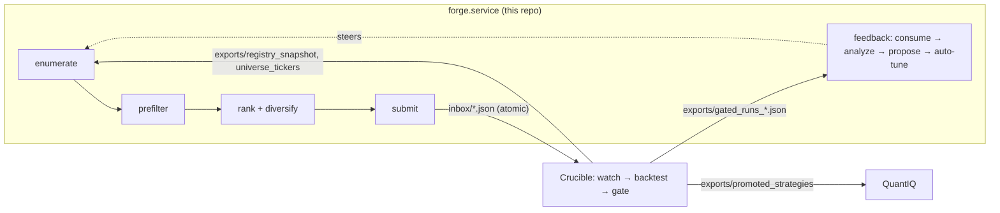

# Architecture — as-built map

Scope: where code lives, how data flows, how changes are classified and attributed. Intent/spec
lives in `docs/DESIGN.md` (§ refs below); live state in `STATUS.md`; terms in `docs/glossary.md`.

## The pipeline

Forge → Crucible → QuantIQ. All inter-system traffic is **files under `~/optbt_data/`** — never
direct DB access (Crucible's `runs.duckdb` is single-writer-locked; Forge reads Crucible only via
its file exports, through `crucible_contracts` helpers).

Per-batch order (§2.1, fixed): load grammar (verify version + archive) → snapshot registry →
enumerate (lazy, seeded) → pre-filter battery (cost-ascending, short-circuit on first failure) →
rank (§6.2 composite) → diversify (greedy, min-per-hypothesis floor) → submit (atomic, idempotent)
→ rate-limit (§7.3: block until ≥80% of the oldest in-flight batch is gated, OR the D137 stall
guard trips — Crucible idle ≥3h with our work pending) → consume feedback →
analyze → propose (auto-apply tightenings; loosenings → `OPEN_PROPOSALS.md`). Cross-batch state
lives in `~/forge_data/forge.db` only — never in process memory across runs.

## Module map

| Package (`src/forge/`) | Role | Spec | Tests (`tests/unit/`) |
|---|---|---|---|
| `grammar/` | Load/validate `config/grammar.yaml`; predicate engine; S4 horizon table (`signal_horizon.py` — Forge-owned, registry `lookback` is a warmup not a horizon, D102); archive consistency (`archive.py`) | §3 | `test_grammar/` |
| `enumeration/` | Search space + seeded sampler; per-indicator threshold table (`indicator_thresholds.py`); underlying classes (`underlying_class.py`); registry fingerprint | §4 | `test_enumeration/` |
| `prefilters/` | `battery.py` runs filters cost-ascending — the live order is in code, not the §5.2 list (it grew past the original 7); `crucible_feature_cache.py` = real cache (via db_writer socket), `feature_cache.py` = synthetic fallback | §5 | `test_prefilters/` |
| `ranking/` | Composite scorer (weights in `config/ranker.yaml`); greedy diversifier (`min_per_hypothesis` floor, D103; per-arm exploration floor, D136 — `arm_floor.py` owns arm extraction + the honest-era mature-arm count, young arms get ≤2 reserved slots / ≤10% batch); learned verdict model (D132 shadow-track: `features.py` extraction, `dataset.py` honest-era frame, `model.py` pure-Python IRLS + artifacts, `shadow.py` post-submit telemetry recorder, `evaluation.py` shadow-vs-incumbent readout — nothing wired into scoring until F3); `regime_supply.py` per-batch regime-complement supply telemetry (T2 shadow, D144 — the `regime_supply:` journal line; classifies ranked survivors' regime-bets into trending-dominant / ranging / bear / other, never reshapes a batch) | §6 | `test_ranking/` |
| `submission/` | Batch orchestration; atomic submit via contracts; §7.3 rate limiter; per-filter logging | §7 | `test_submission/` |
| `feedback/` | `consumer.py` (reconcile + aged-out flush, D052/D110); `analyzer.py`; `proposer.py`; `rejection_weights.py` (learned sampler weights — the D094→D108 lineage); `trade_rate_priors.py` (expected-trades prior + cold-start); `auto_tune.py` (prefilter calibration, tighten-only) | §8 | `test_feedback/` |
| `funnel/` | Per-batch funnel + join-map exports consumed by Crucible's instrumentation (D096) | D096 | `test_funnel/` |
| `persistence/` | `db.py` (the blessed DB open), `schemas.py` (forge.db DDL — table summaries in `docs/MANPAGE.md`), `registry_loader.py` | §9 | `test_persistence.py` |
| `core/` | `clock.py` + `seed.py` (the ONLY time/RNG sources, hard rule #8); `contracts_check.py` (holds the `FORGE_EXPECTED_CONTRACT_VERSION` pin, §13.5); `logging.py` | §13 | `test_phase0_smoke.py` |
| `config/` | `forge_config.py` — precedence: CLI flag > `config/forge.yaml` > hardcoded (`--no-config`) | §10 | `test_config/` |
| `cli/` | `main.py` (`forge` entry point + run loop), `grammar_cmd.py`, `feedback_cmd.py` | — | `test_cli/` |

## Change taxonomy — how a change is classified and attributed

This is the most load-bearing non-obvious convention in the repo:

| Kind | When | Ritual | Attribution |
|---|---|---|---|
| **Grammar-versioned** (enumeration-policy bump) | The emitted config *population* changes (new hypothesis, parameter bounds, predicate pool, threshold/horizon table) | Bump `grammar_version`, archive, D-entry — `docs/tasks/grammar-change.md`. Since v5, most bumps change **no `rules:` text**: the 21 §3.5 rules are operator-owned (hard rule #1); policy lives Python-side | Crucible runs `crucible funnel --compare vN-1 vN` on the cohort — relay the version string + deploy timestamp |
| **Versionless** (feedback/weights) | Only the *draw distribution* over the same population changes | Cold-start byte-identical required (hard rule #6) — `docs/tasks/feedback-change.md` | Read in the submission mix + journal weight lines; `--compare` is confounded |
| **Contracts-gated** | Forge needs a model/field `crucible_contracts` lacks | Surface the gap (hard rule #2), never import Crucible internals; on adoption bump the pin in `core/contracts_check.py` + `uv.lock` + fixtures | `forge check` validates at startup |

Determinism identity: `(grammar_version, registry_hash, seed)` → same enumeration sequence
(hard rule #6; property-tested).

## Live deployment

- Box `aj-workstation`, timezone **UTC since 2026-06-07** (older records are PDT — convert before joining).
- `forge.service` (systemd **user** unit, `deploy/systemd/forge.service`) runs
  `uv run forge run --loop --consume-feedback --require-real-cache` from **this working tree**
  via editable install. A reboot auto-starts it onto whatever the tree contains (D104) — hence the
  worktree + deploy ritual in `docs/tasks/deploy.md`.
- Crucible services/timers and start/stop order: `docs/MANPAGE.md` (PIPELINE SERVICES) and `docs/HOW-TO.md`.
- Forge timers (units in `deploy/systemd/`, symlinked into `~/.config/systemd/user/`):
  `forge-ranker-eval` (05:00, `scripts/daily_ranker_eval.sh` — daily shadow-model train+eval, F3
  streak → `~/forge_data/ranker_eval/streak.jsonl`; deterministic, telemetry-only) and
  `forge-eod-check` (21:00, headless EOD read).
- Forge state: `~/forge_data/forge.db` (DuckDB; live RW lock — snapshot before reading, see
  `docs/tasks/investigate-live.md`). Inter-system paths: table in `docs/HOW-TO.md`.

## Invariant bookmarks (§13)

| Invariant | Enforced by |
|---|---|
| §13.1 deterministic enumeration | `tests/invariants/test_phase2_invariants.py`, `tests/integration/test_batch_reproducibility.py` |
| §13.2 grammar version safety | `scripts/check_grammar_version_bump.py`, `scripts/check_grammar_doc_sync.py` (pre-commit) + `forge.grammar.loader` archive check at startup |
| §13.3 no silent grammar changes | `tests/invariants/test_phase5_invariants.py` (audit row + hard rule #4 structure) |
| §13.4 submission idempotency | `tests/invariants/test_phase4_invariants.py`, `tests/invariants/test_phase6_properties.py` (Hypothesis) |
| §13.5 contracts compatibility | `forge.core.contracts_check.check_contracts_version` at CLI startup (halts on MAJOR mismatch) |
| §13.6 no equity exposure | `tests/invariants/test_phase1_invariants.py` |
| §13.7 resource limits | carry-forward (contracts don't yet expose `worker_mem_limit_mb`) |

## Root-file taxonomy

The repo root holds many `*.md` files that are **records, not documentation**. Read them only when
a specific exchange or decision cites them.

| Pattern | What it is |
|---|---|
| `STATUS.md` | Live state; newest block on top, marked SUPERSEDES. Read first, every session |
| `IMPLEMENTATION_DECISIONS.md` | Append-only decision ledger (D001–D110+); referenced everywhere as "D###" |
| `OPEN_QUESTIONS.md` | Append-only logged uncertainties (Q##) with severity |
| `OPEN_PROPOSALS.md` | Grammar loosening proposals awaiting operator sign-off (hard rule #4) |
| `PHASE_N_HANDOFF.md` | Phase-boundary artifacts; phases 0–6 all complete — historical |
| `PROMPT_CRUCIBLE_*.md`, `*_AGENT_PROMPT.md`, `CRUCIBLE_*_HANDOFF.md`, `CONTRACTS_*` | **Outgoing** cross-repo messages the operator carries to the Crucible/contracts agent (`docs/tasks/crucible-handoff.md`) |
| `../Crucible/docs/handoffs/FORGE_*.md` | **Incoming** responses/handoffs from Crucible |
| `*_PLAN.md`, `*_SPEC.md`, `*_DRAFT.md`, `OPTION_*.md`, `PROMPT_5_*` | Scoping/planning artifacts for specific workstreams |
| `_archive/` | Completed prompt/response pairs |
| `AUDIT.md`, `docs/STRATEGY_GENERATION_STATE.md` | Point-in-time deep reviews — stale-bannered; historical context only |
