# Architecture — as-built map

Scope: where code lives, how data flows, how changes are classified and attributed. Intent/spec
lives in `docs/DESIGN.md` (§ refs below); live state in `STATUS.md`; terms in §Terms at the bottom.
Final state = `docs/proposals/repo-simplification-2026-09.md` §12 (D406/D416): **no daemon; one
weekly, zero-input run.**

## The pipeline

Forge → Crucible → QuantIQ. All inter-system traffic is **files under `~/optbt_data/`** — never
direct DB access (Crucible's `runs.duckdb` is single-writer-locked; Forge reads Crucible only via
its file exports, through `crucible_contracts` helpers — hard rule #2).

```mermaid
flowchart LR
    T["forge-campaign.timer (Sun 03:00 UTC)"] --> B[boot checks]
    B --> RC["reconcile (forge_gated_runs, failed_runs)"] --> TR[train verdict + robustness]
    TR --> BK["book + cell stats (designation_history, promoted_portfolios, component_contributions, forge.db)"]
    BK --> TG["triggers T1–T5"] --> EN["enumerate (unstratified v55)"] --> RS[rejection-sample to cells]
    RS --> PF[prefilter battery] --> G[challenger gate] --> RK["in-cell rank: P(component) × tail_norm"]
    RK --> S["submit ≤ weekly_cap"] --> FX["forge_funnel.json + run record"]
    S -- "inbox/*.json (atomic)" --> C["Crucible: watch → backtest → gate"]
    C -- "exports/forge_gated_runs_*.json (14 d, source=forge)" --> RC
    C -- "exports/promoted_portfolios, designation_history, component_contributions" --> BK
    C -- "exports/registry_snapshot, universe_tickers, refutations" --> EN
    C -- "exports/promoted_portfolios" --> Q[QuantIQ]
```

One run per week (`forge campaign`, `campaign/run.py`), each step named in the journal block and
recorded in `~/forge_data/campaigns/<run_id>.json` (`campaign_run/v1`, replayable from its
`watermarks`). A week with no trigger enumerates and submits nothing — that quiet result is the
design. The daemon loop this replaced (`forge run --loop`, the 24/7 producer) ran from 2026-05 to the
2026-09-14 cutover (D416); its code left the tree in Batch 5 (D417–D423), git history holds it.

## Module map

| Package (`src/forge/`) | Role | Spec | Tests |
|---|---|---|---|
| `campaign/` | The weekly run. `types.py` (the contract: `CellKey`, `Book`, `CampaignSpec`, `TriggerInputs/Outcome`, `GateDecision`, `RunRecord`, `CampaignConfig` defaults), `cell_key.py` (the census 5-tuple; a leaf), `cells.py` (the promoted book via contracts, per-cell verdict stats, dead-cell rule), `triggers.py` (T1–T5 as pure functions + weekly-cap allocation), `gate.py` (structural challenger gate), `train.py` (in-run training + artifact retention), `stop.py` (the SIGTERM stop flag), `report.py` (records + `status`), and the run itself split by step (Batch 6 A4): `run.py` (the orchestrator; every step is called through its namespace so the test seams hold), `exports.py` (export-glob table + content watermarks), `boot.py` (step 0, the operator's only page), `reconcile.py` (step 1: verdicts in, cell stats, in-run training on one connection), `decide.py` (steps 6–7: trigger inputs from the previous record, budget cap), `generate.py` (steps 5, 8–11: the unchanged cold-start draw, rejection-sample, battery, in-cell rank — the byte-identical part), `submit.py` (step 12) | plan §12 | `unit/test_campaign/`, `invariants/test_campaign_invariants.py`, `test_batch5_prep_seams.py` |
| `enumeration/` | Search space + seeded sampler (the v55 population, hard rule #6); `indicator_thresholds.py`; `underlying_class.py`; `chain_inception.py`; `refutations.py` (D320 routing, fingerprint in `enumeration_inputs_hash`); registry fingerprint | §4 | `unit/test_enumeration/`, the goldens |
| `grammar/` | Load/validate `config/grammar.yaml` (archive hash check), the three predicate types v55 uses (`cardinality`, `numerical_range`, `custom_python`), `custom_predicates.py` (the 16 §3.5 functions), `signal_horizon.py` (S4), `version_audit.py` | §3 | `unit/test_grammar/`, `integration/test_v1_grammar.py` |
| `prefilters/` | `battery.py` runs the 9 filters cost-ascending, short-circuit on first failure; `factory.py` builds the real cache (`require_real=True` in production — never the synthetic one) | §5 | `unit/test_prefilters/` |
| `ranking/` | What the run ranks with: `features.py`, `dataset.py` (the honest-era training frame), `model.py` (IRLS verdict / robustness models, artifact load/save, `QUALITY_LANE_TARGET`), `shadow.py` (per-submission `P(component)` telemetry into `shadow_scores`; never read by the run), `signal_key.py` (content keys + Jaccard, the gate's duplicate measure), `types.py` (`RankedCandidate`) | §6 (bannered) | `unit/test_ranking/`, `invariants/test_learned_ranker_invariants.py` |
| `feedback/` | `consumer.py` (reconcile exports into the verdict ledger, aged-out + failed-run flush), `preregistration.py` (the ledger behind `forge prereg`, the `freeze-governance` hook's data, the boot-time DUE judge), `trade_rate_priors.py` (the `expected_trades` prior), `eras.py` (label-era cuts + honesty helpers), `types.py` | §8.1–8.2 | `unit/test_feedback/`, `invariants/test_phase5_invariants.py` |
| `submission/` | `submitter.py` (atomic submit via contracts, idempotent on `config_hash`, the per-batch rejection counts the funnel reads, the between-candidates stop contract), `batch.py` (deterministic `batch_id`), `search_multiplicity.py` (D310 `search_n_trials` stamp) | §7 | `unit/test_submission/`, `invariants/test_phase4_invariants.py` |
| `funnel/` | `forge_funnel.json` + the version map Crucible's `funnel --compare` reads (D096; shape frozen) | D096 | `unit/test_funnel/`, `invariants/test_funnel_invariants.py` |
| `persistence/` | `db.py` (the blessed DB open), `schemas.py` (DDL), `verdicts.py` (durable verdicts, `CONVERTING_DECISIONS`), `fingerprints.py`, `registry_loader.py` (tolerant registry reader, D262) | §9 | `unit/test_persistence.py`, `test_registry_loader.py` |
| `core/` | `clock.py` + `seed.py` (the ONLY time/RNG sources, hard rule #8); `contracts_check.py` (the `FORGE_EXPECTED_CONTRACT_VERSION` pin, §13.5); `logging.py` | §13 | `invariants/test_phase0_invariants.py` |
| `config/` | `forge_config.py` — `forge.yaml` = `db_path` + `crucible.inbox_path` + optional `campaign:` overrides; precedence CLI flag > yaml > `CampaignConfig` defaults; a retired key fails loud | §10 | `unit/test_config/` |
| `cli/` | `main.py` (thin Typer entry: `version`, `check`, `enumerate`, `prefilter`), `campaign_cmd.py` (`forge campaign` + `status`), `prereg_cmd.py` | — | `unit/test_cli/`, `integration/test_cli_help.py` |

## Change taxonomy — how a change is classified and attributed

| Kind | When | Ritual | Attribution |
|---|---|---|---|
| **Grammar-versioned** (enumeration-policy bump) | The emitted config *population* changes (new hypothesis, parameter bounds, predicate pool, threshold/horizon table). The grammar is FROZEN at v55 (D390): only a §5 reopener, with a preregistration first | Prereg → bump `grammar_version` → archive → D-entry → goldens re-pinned → emission proof (`docs/tasks/grammar-change.md`). The 21 §3.5 rules are operator-owned (hard rule #1) | Crucible runs `crucible funnel --compare vN-1 vN` on the cohort — relay the version string + the first run's instant |
| **Campaign-policy** (a trigger, budget, gate or cell rule) | Which members of the same population get submitted | TDD in `campaign/`; the population must stay byte-identical (the goldens + `test_campaign_invariants` subsequence proof); D-entry | Visible in the run records (`campaigns`, `gated_out`, `submitted_hashes`) |
| **Contracts-gated** | Forge needs a model/field `crucible_contracts` lacks | Surface the gap (hard rule #2), never import Crucible internals; on adoption bump the pin in `core/contracts_check.py` + `uv.lock`; the next weekly run binds it (no process to restart) | `forge check` validates at startup |

Determinism identity: `(grammar_version, registry_hash, seed)` → same enumeration sequence (hard
rule #6; property-tested). The weekly seed is `blake2b(grammar_version | registry_hash | ISO week)`,
so the same week on the same inputs replays the same plan.

## Live deployment

- Box `aj-workstation`, timezone **UTC since 2026-06-07** (older records are PDT — convert before joining).
- **Two systemd user timers, no daemon** (units in `deploy/systemd/`, symlinked into
  `~/.config/systemd/user/`): `forge-campaign.timer` (Sunday 03:00 UTC → `scripts/campaign_run.sh` →
  `forge campaign`; the unit's `Environment=FORGE_CAMPAIGN_MODE=live` is the one operator decision it
  carries — `dry-run` snapshots the DB and plans only; `MemoryHigh=20G` / `MemoryMax=32G` fail the
  unit rather than starve Crucible; no `SuccessExitStatus` — a FAILED unit is the only page) and
  `forge-backup.timer` (Sunday 04:30 UTC, `scripts/backup_forge_db.sh`).
- The run executes **this working tree** via editable install: a commit is the deploy, a reboot
  re-arms the timer onto whatever the tree contains (the D104 hazard at weekly cadence) — hence
  `docs/tasks/deploy.md`: preflight → commit → the next run deploys; verify with `forge campaign --dry-run`.
- Forge state: `~/forge_data/forge.db` (DuckDB) — snapshot before reading during a run
  (`scripts/live_db_snapshot.sh`, `docs/tasks/investigate-live.md`); models in `~/forge_data/models/`
  (newest `models_keep` per family); records in `~/forge_data/campaigns/`.
- `scripts/`: the two timer entrypoints, the snapshot idiom, the preflight gate, the three pre-commit
  hooks — inventory in `docs/MANPAGE.md` §SCRIPTS.

## Invariant bookmarks (§13)

| Invariant | Enforced by |
|---|---|
| §13.1 deterministic enumeration | `tests/invariants/test_phase2_invariants.py`, the sampler goldens in `tests/unit/test_enumeration/`, `tests/invariants/test_campaign_invariants.py` (the kept configs are a subsequence of the cold-start sequence), `tests/integration/test_batch_reproducibility.py` (two runs, disjoint workspaces, byte-identical inbox files) |
| §13.2 grammar version safety | `scripts/check_grammar_version_bump.py`, `scripts/check_grammar_doc_sync.py`, `scripts/check_freeze_governance.py` (pre-commit; wiring asserted by `tests/invariants/test_phase6_invariants.py`) + the `forge.grammar.loader` archive hash check at run start |
| §13.3 no silent grammar changes | `tests/invariants/test_phase5_invariants.py` (the D051 audit row; no `src/` module writes `grammar.yaml` at runtime) |
| §13.4 submission idempotency | `tests/invariants/test_phase4_invariants.py`, `tests/invariants/test_phase6_properties.py` (Hypothesis), `tests/unit/test_submission/test_submitter.py` |
| §13.5 contracts compatibility | `forge.core.contracts_check.check_contracts_version` at CLI startup and in the campaign boot check; `tests/integration/test_contracts_integration.py` (pin == installed) |
| §13.6 no equity exposure | `tests/invariants/test_phase1_invariants.py` |
| §13.7 resource limits | the unit's `MemoryHigh`/`MemoryMax` (contracts don't expose `worker_mem_limit_mb`) |

## Root-file taxonomy

The repo root holds a small curated set of `*.md` files; beyond `CLAUDE.md`/`README.md`
(documentation proper) they are **records, not documentation**. Read them only when a specific
exchange or decision cites them. Resolved records are swept to `_archive/` in the resolving commit
(D202), so every root file should match a row below.

| Pattern | What it is |
|---|---|
| `STATUS.md` | Live state; newest block on top. Read first, every session. Older months rotate to `_archive/STATUS_<era>.md` |
| `IMPLEMENTATION_DECISIONS.md` | Append-only decision ledger ("D###"), currently D351+; D001–D350 in `_archive/IMPLEMENTATION_DECISIONS_*` slices |
| `OPEN_QUESTIONS.md` | **OPEN** questions only (Q##, severity); resolved entries sweep to `_archive/OPEN_QUESTIONS_RESOLVED.md` in the resolving commit |
| `OPEN_PROPOSALS.md` | Static, machine-parsed record of the daemon era's grammar proposals (`forge-proposals/v1`, QuantIQ parses it). No writer since D420; never rotated (D298) |
| `PROMPT_CRUCIBLE_PATHC_DEBIT_VERTICAL_SIZING.md` | The one operator-**parked** relay (D152, Path C — freeze reopener 3). The root-relay channel is RETIRED — relays live in `~/proj/freeze/relays/` + the two INDEX ledgers (D362, `docs/tasks/crucible-handoff.md`) |
| `_archive/` | Completed/landed records, swept once their D-entry lands (D202/D241): terminal proposals (`PROPOSAL_*.md`), phase handoffs, the July audits, point-in-time reviews, the ledger-rotation slices |

## Terms — domain jargon an agent would misread

Code identifiers are findable by grep; this covers concepts.

- **Gated** — Crucible finished backtesting a config and recorded a decision. NOT "passed";
  most gated runs are rejections. `submissions.status` flips `submitted → gated` on reconcile.
- **Component** — a gated config Crucible accepts as a portfolio building block. The binding gate
  sits at promotion, not gating.
- **Promotion** — full gate pass; a promoted BOOK (a weighted basket of components) is what
  QuantIQ trades. The **designated** book is the one QuantIQ runs, named by Crucible's
  `designation_history` export; it changes only by the operator.
- **Cell** — `(hypothesis, dte_bucket, axis, directional, regime)`, the census key
  (`campaign/cell_key.py`); `axis` ∈ {named, xsect}; `-` marks an absent role. Protection and
  evidence live at this granularity.
- **Protected cell** — a cell occupied by a leg of ANY promoted book; never a campaign target unless a
  T1 replacement campaign names it.
- **Dead cell** — at or above the volume floor (`dead_min_decided` decided verdicts) with zero
  converting, or a converting rate below `dead_ratio_to_baseline` × its hypothesis's rate; a
  hypothesis that converts nowhere flags no cell (`campaign/cells.classify_dead`, the D302 guard).
- **Dark cell** — a cell the run's enumeration sample reaches that has never been submitted or
  decided; T5 rotates through them deterministically by ISO week.
- **Trigger** — one of five pure functions of the exports + the verdict ledger that names cells and a
  budget: T1 `leg_health` (designation flip), T2 `refutation_retraction` (content diff of the
  refutations export), T3 `registry_change` (new id in an existing family), T4 `basis_refresh`
  (near-floor cell with stale evidence), T5 `exploration_floor` (dark cells). No trigger = no
  submission.
- **Challenger gate** — the structural filter on battery survivors: protected cell, Jaccard signal
  overlap ≥ `duplicate_jaccard` to a book leg, dead cell. Never Crucible's `corr_to_book` label
  (decorrelation is owned at assembly, D186/D187).
- **Run record** — `~/forge_data/campaigns/<run_id>.json` (`campaign_run/v1`): boot rows, triggers,
  campaigns, counts, `submitted_hashes` (Crucible's `ranked`-arm boundary join key — never rename),
  watermarks and baselines; replayable.
- **The forge stream** — `exports/forge_gated_runs_*.json`, Crucible's `source='forge'` 14-day
  window (contracts 1.48.0). `truncated: true` = the OLDEST verdicts are missing → the run skips the
  aged-out flush; expected until the daemon's tail ages out (~2026-09-28), an anomaly after.
- **The gated export** — `exports/gated_runs_*.json`, the ALL-source rolling window (~24 h); the
  fallback when the forge stream is absent (flush off there too).
- **Hypothesis** — the one market thesis a config declares (S1). The allowed set is the contracts
  Literal; `regime_arbitrage` left enumeration in v5 (D098).
- **Directional signal vs regime gate** — directionals generate entries; regime signals gate
  *when* entries are allowed. The same indicator can serve both with different ops (hurst:
  `<` directional for MR, `>` regime for trend, D100).
- **Combiner / `cross_sectional_rank`** — how multiple signals merge; xsect-rank ranks a universe
  cross-sectionally instead of gating one underlying (v12, H1).
- **DTE bucket** — discrete days-to-expiry class, derived as `k × signal horizon` from the
  Forge-owned table in `grammar/signal_horizon.py` (D102).
- **Enumeration-policy bump** — a grammar_version bump with NO `rules:` text change; the policy shift
  is Python-side (the norm since v5). Frozen with the grammar.
- **Cold-start** — the sampler's draw with no learned inputs; the population the goldens pin
  byte-identically and the one the campaign enumerates (unstratified, `min_hypothesis_fraction=0.0`).
- **Emission proof** — before deploying an enumeration change: sample thousands of configs against
  the live registry export and verify the emitted mix shows the intended change
  (`docs/tasks/grammar-change.md`). A log line is not an emission proof (D352).
- **Uncontended suite** — the full `pytest`; the deploy gate (`scripts/deploy_preflight.sh`).
- **Breadth vs quality lever** — Grinold framing (IR = IC·√Breadth); the binding gate failure is
  trade count (breadth), so quality-only levers have a low ceiling.
- **Aged-out flush / sentinel** — the consumer marks dead `submitted` rows gated with a nil-UUID
  sentinel once behind the export watermark (D110; the D240 failed-run retirement reuses it). Off
  whenever the window is truncated or absent (D412/D415).
- **Reconcile** — the consumer joining gated + failed exports against `submissions` and flipping
  statuses; once per weekly run.
- **Timestamp eras** — records before 2026-06-07 are PDT (old box), after are UTC; the full era table
  is in `docs/HOW-TO.md` §Eras.
- **Funnel compare** — `crucible funnel --compare vA vB` (Crucible-side) attributes a
  grammar-versioned change by cohort; it reads `forge_funnel.json` (shape frozen, D096).
